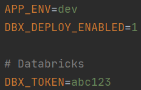

# Bricksflow Example Project

## 1. What's inside

This is a Bricksflow project skeleton covering our **best practices for Databricks projects**. Bricksflow is focused on the following paradigms:

* anyone with basic python skills can create pipelines and improve the business logic,
* developing a standard DataLake project requires almost no engineers,
* one code for all environments (your favorite IDE + Databricks UI),
* pursue consistency as the project grows.

**Base components** to be used by everyone:

1. Configuration in YAML
1. Tables & schema management
1. Automated deployment to Databricks
1. Documentation automation

**Advanced components** to be used mostly by engineers:

1. Production releases workflow
1. Unit & pipeline testing
1. Extensions API

Read more at [Bricksflow: Databricks development made convenient
](https://medium.com/datasentics/bricksflow-databricks-development-made-convenient-3b0cc486c856)  

## 2. Local environment setup

The following software needs to be installed first:
  * [Miniconda package manager](https://docs.conda.io/en/latest/miniconda.html)
  * [Git for Windows](https://git-scm.com/download/win) or standard Git in Linux (_apt-get install git_)
  
We recommend using the following IDEs:  
  * [PyCharm Community or Pro](https://www.jetbrains.com/pycharm/download/) with the [EnvFile plugin](https://plugins.jetbrains.com/plugin/7861-envfile) installed
  * [Visual Studio Code](https://code.visualstudio.com/download) with the [PYTHONPATH setter extension](https://marketplace.visualstudio.com/items?itemName=datasentics.pythonpath-setter) installed

## 3. Create your first Bricksflow-powered project

* On **Windows**, use Git Bash.
* On **Linux/Mac**, the use standard terminal 

```
# check documentation on https://github.com/bricksflow/project-creator

source <(curl -s https://raw.githubusercontent.com/bricksflow/project-creator/master/create_project.sh)
```

When the environment setup is completed, update the `[PROJECT_ROOT]/.env` file with the appropriate values.



Now activate the Conda environment:

```bash
$ conda activate $PWD/.venv
```

or use a shortcut

```bash
$ ca
```

## 4. Important scripts

1. ```./pylint.sh``` - checks coding standards
1. ```./run_tests.sh``` - runs tests
